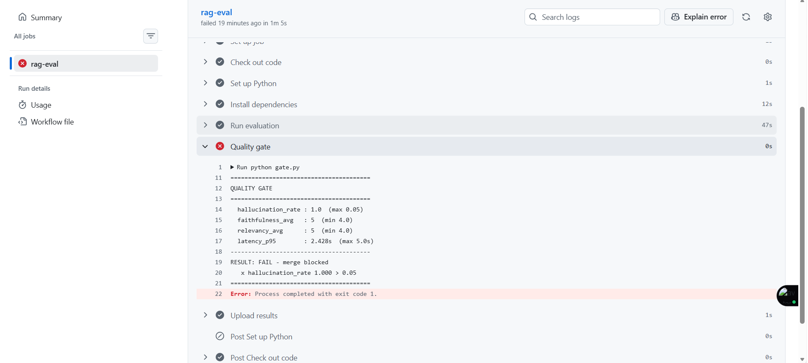

# LLM RAG Evaluation CI/CD Pipeline

An automated evaluation pipeline that treats a Retrieval-Augmented Generation (RAG) system like production software: every code change runs a suite of quality evaluations in CI, and the build is **blocked from merging** if the system regresses — hallucinates too often, drops in answer quality, or gets too slow.

Think of it as **unit tests for an LLM app**.

**Author:** Lawanya Damroo Priya · [github.com/Lawanya1998](https://github.com/Lawanya1998)

---

## Why this exists

LLM outputs are non-deterministic and "correctness" is fuzzy, so you can't guard them with normal assertions. A prompt tweak, a model swap, or a change to the knowledge base can silently make the system worse. This project catches those regressions automatically — before they ship — by scoring the system on every push and failing the CI check when quality drops below a threshold.

---

## The pipeline

```
                        ┌─────────────────────────────────────────────┐
  git push / PR  ──────▶│              GitHub Actions                  │
                        │                                             │
                        │  knowledge_base/ ──▶ retrieve (TF-IDF)       │
                        │        │                   │                 │
                        │        ▼                   ▼                 │
                        │   golden.jsonl ──▶  RAG answer (Groq LLM)    │
                        │        │                   │                 │
                        │        ▼                   ▼                 │
                        │      score  ◀── LLM-as-judge + metrics       │
                        │        │                                     │
                        │        ▼                                     │
                        │   quality gate ──▶ PASS ✅ / FAIL ❌ merge    │
                        └─────────────────────────────────────────────┘
```

1. **Retrieve** — a TF-IDF retriever pulls the most relevant chunks from a small document knowledge base.
2. **Generate** — an LLM (served via Groq) answers using *only* the retrieved context, and is instructed to refuse when the answer isn't present.
3. **Score** — each answer is evaluated on faithfulness, relevancy, hallucination, latency, and cost.
4. **Gate** — a threshold check exits non-zero (blocking the merge) if any metric breaches its limit.

---

## Metrics measured

| Metric | How it's measured | Gate threshold |
|---|---|---|
| **Faithfulness** | LLM-as-judge (1–5): is every claim supported by the retrieved context? | ≥ 4.0 |
| **Answer relevancy** | LLM-as-judge (1–5): does the answer address the question? | ≥ 4.0 |
| **Hallucination rate** | Share of *unanswerable* questions the system wrongly answered instead of refusing | ≤ 5% |
| **Latency p50 / p95** | Median and tail response time per query | p95 ≤ 5s |
| **Cost per query** | Average token cost per request | tracked |

The gate also runs a **baseline regression check**: faithfulness must not drop more than 0.5 versus the previous run, catching gradual erosion even when metrics are still above the absolute floor.

---

## Proof it works: a caught regression

To validate the gate, a pull request deliberately removed the instruction that tells the model to refuse unanswerable questions. The system began fabricating answers, the hallucination rate jumped to **1.0**, and CI **blocked the merge**:

```
========================================
QUALITY GATE
========================================
  hallucination_rate : 1.0  (max 0.05)
  faithfulness_avg   : 5    (min 4.0)
  relevancy_avg      : 5    (min 4.0)
  latency_p95        : 2.428s  (max 5.0s)
----------------------------------------
RESULT: FAIL - merge blocked
   x hallucination_rate 1.000 > 0.05
========================================
Error: Process completed with exit code 1
```



On the healthy `main` branch, all metrics pass and the check is green.

---

## Tech stack

- **Python**
- **Groq** — fast LLM inference (Llama 3.3 70B) for both generation and the judge
- **scikit-learn** — TF-IDF retrieval
- **GitHub Actions** — CI/CD execution and merge gating

---

## Running it locally

```bash
# 1. install
pip install -r requirements.txt

# 2. set your Groq API key
export GROQ_API_KEY=gsk_your_key_here      # PowerShell: $env:GROQ_API_KEY="..."

# 3. run the pipeline
python rag.py        # smoke-test the RAG bot
python eval.py       # run the full eval, writes results.json
python gate.py       # apply the quality gate (exit 1 = fail)
```

In CI, the Groq key is provided via a GitHub Actions **repository secret** named `GROQ_API_KEY` — it is never committed to the repo.

---

## Project structure

```
├── knowledge_base/        # source documents the RAG bot answers from
├── rag.py                 # retrieval + generation pipeline (provider-agnostic)
├── golden.jsonl           # evaluation dataset (question, reference, expected source)
├── eval.py                # runs the pipeline over the golden set and scores it
├── gate.py                # threshold + regression quality gate
└── .github/workflows/     # GitHub Actions CI definition
```

---

## Design decisions & limitations

Honest notes on scope, and what a production version would add:

- **TF-IDF retrieval** was chosen for reproducibility and zero setup. The `Retriever` class has a clean interface, so vector embeddings can be dropped in without touching the rest of the pipeline. Retrieval precision is the most obvious upgrade.
- **Same model as its own judge.** Using one model to both answer and grade introduces a known bias. A more rigorous setup uses a separate, stronger judge model or human-labelled validation.
- **Small, hand-crafted dataset** (24 cases, 5 unanswerable). Enough to prove the loop end to end; a real system would use a larger, real-world-sourced, human-labelled golden set with harder, more ambiguous cases to create meaningful score spread.
- **Provider-agnostic.** Generation runs on Groq here, but the pipeline was migrated from another provider by swapping only the client — retrieval, scoring, and CI were untouched.
